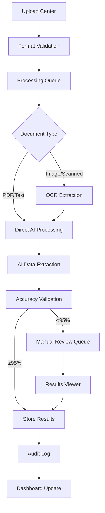

## 1. Product Overview

Sistema inteligente de procesamiento de documentos con IA diseñado para reemplazar el lector de PDF 2D fallido. La solución garantiza extracción precisa de información de múltiples formatos documentales mediante tecnología OCR e IA avanzada.

El producto resuelve problemas críticos de extracción de datos, automatiza procesos manuales y proporciona un pipeline escalable para manejo masivo de documentos. Dirigido a empresas que requieren procesamiento eficiente y seguro de documentos con alta precisión.

## 2. Core Features

### 2.1 User Roles

| Role | Registration Method | Core Permissions |
|------|---------------------|------------------|
| Admin User | Email + role assignment | Full system access, user management, configuration |
| Operator | Email registration | Document upload, processing monitoring, basic reports |
| Viewer | Email invitation | Read-only access to processed documents and statistics |
| API User | API key generation | Programmatic access to processing endpoints |

### 2.2 Feature Module

El sistema de procesamiento de documentos con IA consta de las siguientes páginas principales:

1. **Dashboard**: métricas en tiempo real, estado del sistema, gráficos de rendimiento
2. **Upload Center**: carga masiva de documentos, validación de formatos, cola de procesamiento
3. **Processing Monitor**: visualización de pipeline, estado de documentos, gestión de errores
4. **Results Viewer**: visualización de datos extraídos, verificación manual, exportación
5. **Configuration Panel**: gestión de modelos IA, umbrales de precisión, parámetros OCR
6. **Audit Log**: registro de actividades, trazabilidad de procesos, cumplimiento normativo

### 2.3 Page Details

| Page Name | Module Name | Feature description |
|-----------|-------------|---------------------|
| Dashboard | Real-time Metrics | Visualizar tasa de procesamiento, precisión actual, documentos en cola, uptime del sistema |
| Dashboard | Performance Charts | Mostrar gráficos de tendencias históricas, comparativas por tipo de documento, alertas de rendimiento |
| Upload Center | Batch Upload | Permitir carga de hasta 100 documentos simultáneos, validación automática de formatos soportados |
| Upload Center | Format Validation | Verificar PDF, DOCX, JPG, PNG, TIFF, rechazar archivos corruptos o no soportados |
| Upload Center | Processing Queue | Mostrar posición en cola, tiempo estimado de procesamiento, priorización de documentos |
| Processing Monitor | Pipeline Visualization | Mostrar etapas de procesamiento (OCR, IA, validación), documentos en cada fase |
| Processing Monitor | Error Management | Identificar documentos fallidos, permitir reintento manual, descarga de logs de error |
| Results Viewer | Data Display | Presentar información extraída en formato estructurado, resaltar campos críticos |
| Results Viewer | Manual Verification | Permitir corrección de datos extraídos, validación de campos obligatorios, guardar cambios |
| Results Viewer | Export Options | Exportar resultados en JSON, CSV, XML, integración con sistemas externos vía API |
| Configuration Panel | AI Model Management | Seleccionar modelos de IA según tipo de documento, ajustar confianza de predicción |
| Configuration Panel | OCR Parameters | Configurar idioma, calidad de imagen, sensibilidad de detección de texto |
| Audit Log | Activity Tracking | Registrar todas las operaciones de usuarios, cambios en configuración, accesos al sistema |
| Audit Log | Compliance Reports | Generar reportes de auditoría para cumplimiento normativo, búsqueda avanzada de eventos |

## 3. Core Process

### Flujo de Procesamiento de Documentos

1. **Usuario** carga documentos en el Upload Center
2. **Sistema** valida formatos y agrega a cola de procesamiento
3. **Motor OCR** extrae texto de documentos escaneados/imágenes
4. **Motor IA** analiza y extrae información estructurada
5. **Sistema** valida precisión y aplica reglas de negocio
6. **Usuario** revisa y verifica resultados en Results Viewer
7. **Sistema** almacena resultados en base de datos con encriptación
8. **API** permite integración con sistemas externos

## 4. User Interface Design

### 4.1 Design Style

- **Colores Primarios**: Azul profesional (#2563EB) para elementos principales
- **Colores Secundarios**: Gris neutro (#6B7280) para textos secundarios
- **Colores de Estado**: Verde éxito (#10B981), Rojo error (#EF4444), Amarillo advertencia (#F59E0B)
- **Estilo de Botones**: Bordes redondeados (8px), sombra sutil, efecto hover
- **Tipografía**: Inter para interfaces, monospace para datos técnicos
- **Tamaños de Fuente**: 14px body, 16px headers, 12px labels
- **Estilo de Layout**: Tarjetas con bordes redondeados, espaciado generoso
- **Iconos**: Estilo outline de Heroicons, consistente y minimalista

### 4.2 Page Design Overview

| Page Name | Module Name | UI Elements |
|-----------|-------------|-------------|
| Dashboard | Metrics Cards | Cards con iconos grandes, números destacados en azul, tendencias con flechas direccionales |
| Dashboard | Charts | Gráficos de líneas para tendencias, barras para comparativas, colores consistentes con paleta |
| Upload Center | Upload Area | Drag-and-drop zone con borde punteado, botón de explorar archivos, preview de archivos cargados |
| Processing Monitor | Status Cards | Cards horizontales con barra de progreso, icono de estado, tiempo transcurrido |
| Results Viewer | Data Table | Tabla con filas alternadas, columnas ordenables, búsqueda y filtros avanzados |
| Configuration Panel | Settings Form | Formularios con switches toggles, sliders para valores numéricos, validación visual inline |

### 4.3 Responsiveness

- **Desktop-first**: Optimizado para pantallas 1920x1080 y superiores
- **Mobile-adaptive**: Breakpoints en 768px y 480px para tablets y móviles
- **Touch optimization**: Botones mínimo 44px, espaciado aumentado para interacción táctil
- **Progressive enhancement**: Funcionalidad básica en dispositivos antiguos

## 5. Requisitos de Negocio

### 5.1 Requisitos Funcionales

- **RF01**: Sistema debe procesar mínimo 1000 documentos/día con latencia <5 segundos por documento
- **RF02**: Precisión mínima del 95% en extracción de datos críticos (nombres, fechas, montos)
- **RF03**: Soporte para formatos: PDF, DOCX, JPG, PNG, TIFF con tamaño máximo 50MB
- **RF04**: Pipeline de procesamiento con reintentos automáticos hasta 3 veces
- **RF05**: Encriptación AES-256 para documentos confidenciales en reposo y tránsito
- **RF06**: API RESTful con autenticación OAuth 2.0 y rate limiting
- **RF07**: Sistema de colas con priorización por tipo de documento y urgencia
- **RF08**: Logs detallados con trazabilidad completa de operaciones

### 5.2 Requisitos No Funcionales

- **RNF01**: Disponibilidad 99.9% (máximo 8.76 horas downtime/año)
- **RNF02**: Escalabilidad horizontal para soportar 10x carga actual
- **RNF03**: Tiempo de recuperación ante desastres <4 horas
- **RNF04**: Cumplimiento GDPR y normativas locales de protección de datos
- **RNF05**: Auditoría de seguridad trimestral con certificaciones
- **RNF06**: Documentación técnica y de usuario completa

## 6. KPIs y Métricas de Éxito

### 6.1 Métricas de Rendimiento

| KPI | Objetivo | Frecuencia de Medición |
|-----|----------|------------------------|
| Precisión de extracción | ≥95% | Diaria por lote |
| Tiempo promedio procesamiento | <5 segundos/documento | Diaria |
| Documentos procesados/día | ≥1000 | Diaria |
| Tasa de errores | <2% | Semanal |
| Disponibilidad del sistema | ≥99.9% | Mensual |
| Tiempo recuperación errores | <30 minutos | Por incidente |

### 6.2 Métricas de Negocio

- **ROI**: Reducción 70% en tiempo manual de procesamiento
- **Costo por documento**: <0.10 USD incluyendo infraestructura
- **Satisfacción del usuario**: NPS >8 en encuestas trimestrales
- **Adopción**: 100% usuarios migrados en 3 meses
- **Reducción errores humanos**: 90% vs proceso manual anterior

## 7. Alcance y Limitaciones

### 7.1 Alcance del Proyecto

- **Incluye**: Desarrollo completo del sistema, integración con Supabase, API REST, dashboard web
- **Incluye**: Modelos IA pre-entrenados para documentos financieros y legales
- **Incluye**: Sistema de encriptación y seguridad empresarial
- **Incluye**: Documentación, capacitación y soporte inicial 6 meses

### 7.2 Limitaciones

- **No incluye**: Desarrollo de modelos IA personalizados (usa modelos pre-entrenados)
- **No incluye**: Integración con sistemas legacy del cliente (requiere proyecto separado)
- **No incluye**: Almacenamiento ilimitado (límites según plan Supabase)
- **No incluye**: Procesamiento de vídeos o audio
- **Limitación técnica**: Máximo 50MB por archivo, resolución imagen máxima 10Kx10K píxeles

## 8. Cronograma de Implementación

### Fase 1: Fundación (Mes 1-2)
- Configuración infraestructura Supabase
- Desarrollo core API y autenticación
- Implementación OCR básico
- Pipeline de procesamiento inicial

### Fase 2: Inteligencia Artificial (Mes 2-3)
- Integración modelos IA para extracción
- Validación de precisión y ajuste de umbrales
- Sistema de reintentos y manejo de errores
- Testing con dataset de producción

### Fase 3: Interfaz de Usuario (Mes 3-4)
- Desarrollo dashboard y monitoring
- Upload center con batch processing
- Results viewer con verificación manual
- Sistema de reportes y auditoría

### Fase 4: Seguridad y Optimización (Mes 4-5)
- Implementación encriptación AES-256
- Auditoría de seguridad completa
- Optimización de rendimiento
- Documentación técnica y de usuario

### Fase 5: Producción y Migración (Mes 5-6)
- Deploy en producción con blue-green deployment
- Migración de datos históricos
- Capacitación de usuarios
- Monitoreo intensivo primeros 30 días

**Fecha estimada de lanzamiento**: Mes 6
**Total duración**: 6 meses con equipo de 5 desarrolladores