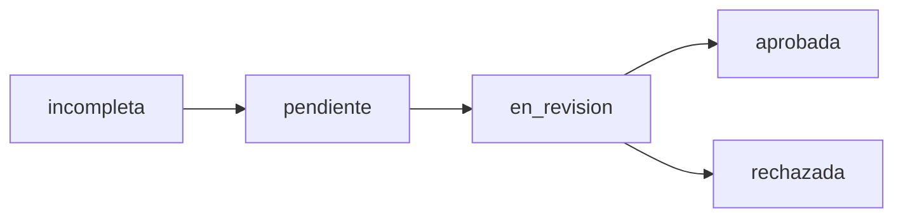

# 📊 ESTRUCTURA DE BASE DE DATOS - WALLY

**Wy Crédito Tecnología**  
*Sistema de Solicitudes de Crédito Conversacional*

---

## 📋 ÍNDICE

1. [Resumen General](#resumen-general)
2. [Tablas Principales](#tablas-principales)
   - [Solicitudes](#1-tabla-solicitudes)
   - [Documentos](#2-tabla-documentos)
   - [Conversaciones](#3-tabla-conversaciones)
   - [Logs del Orquestador](#4-tabla-orquestador_logs)
3. [Vistas](#vistas-útiles)
4. [Funciones y Triggers](#funciones-y-triggers)
5. [Índices](#índices-de-optimización)
6. [Seguridad](#seguridad-rls)
7. [Ejemplos de Uso](#ejemplos-de-uso)

---

## 🎯 RESUMEN GENERAL

La base de datos de Wally está diseñada para soportar un sistema completo de solicitudes de crédito conversacional. Utiliza **PostgreSQL** con **Supabase** como backend, implementando las mejores prácticas de seguridad y optimización.

### Características Principales:
- ✅ **4 Tablas Principales** para el flujo completo
- ✅ **Row Level Security (RLS)** habilitado
- ✅ **Triggers automáticos** para consistencia de datos
- ✅ **Índices optimizados** para consultas frecuentes
- ✅ **Vistas útiles** para reportes y dashboards
- ✅ **Funciones auxiliares** para automatización

---

## 📊 TABLAS PRINCIPALES

### 1. TABLA: `solicitudes`

**Descripción:** Tabla central que almacena toda la información de las solicitudes de crédito empresarial.

#### 🔑 Estructura de Campos:

| Campo | Tipo | Descripción | Requerido | Valores Permitidos |
|-------|------|-------------|-----------|-------------------|
| **IDENTIFICADORES Y METADATOS** |
| `id` | UUID | Clave primaria (auto-generada) | ✅ | UUID v4 |
| `email_solicitante` | TEXT | Email del solicitante | ✅ | Email válido |
| `estado` | TEXT | Estado actual de la solicitud | ✅ | `incompleta`, `pendiente`, `en_revision`, `aprobada`, `rechazada` |
| `created_at` | TIMESTAMPTZ | Fecha de creación | ✅ | Auto-generado |
| `updated_at` | TIMESTAMPTZ | Fecha de última actualización | ✅ | Auto-actualizado |
| `codigo_seguimiento` | TEXT | Código único de seguimiento | ✅ | `WY-YYYY-XXXXXX` (auto-generado) |
| **INFORMACIÓN DE LA EMPRESA** |
| `nit` | TEXT | Número de identificación tributaria | ❌ | NIT válido |
| `razon_social` | TEXT | Razón social de la empresa | ❌ | Texto libre |
| `tipo_empresa` | TEXT | Tipo de empresa | ❌ | SAS, LTDA, SA, etc. |
| `sitio_web` | TEXT | Sitio web de la empresa | ❌ | URL válida |
| `telefono_empresa` | TEXT | Teléfono de la empresa | ❌ | Número telefónico |
| `direccion_empresa` | TEXT | Dirección física | ❌ | Dirección completa |
| `ciudad` | TEXT | Ciudad | ❌ | Nombre de ciudad |
| `departamento` | TEXT | Departamento | ❌ | Departamento de Colombia |
| **REPRESENTANTE LEGAL** |
| `nombre_representante` | TEXT | Nombre del representante legal | ❌ | Texto libre |
| `apellido_representante` | TEXT | Apellido del representante legal | ❌ | Texto libre |
| `tipo_documento_rl` | TEXT | Tipo de documento | ❌ | `CC`, `CE`, `Pasaporte` |
| `numero_documento_rl` | TEXT | Número de documento | ❌ | Número de documento |
| `telefono_rl` | TEXT | Teléfono del representante | ❌ | Número telefónico |
| `email_rl` | TEXT | Email del representante | ❌ | Email válido |
| **INFORMACIÓN FINANCIERA** |
| `monto_solicitado` | DECIMAL(15,2) | Monto del crédito solicitado | ❌ | Valor monetario |
| `plazo_solicitado` | INTEGER | Plazo en meses | ❌ | 1-360 meses |
| `destino_credito` | TEXT | Destino del crédito | ❌ | Texto descriptivo |
| `ingresos_mensuales` | DECIMAL(15,2) | Ingresos mensuales | ❌ | Valor monetario |
| `egresos_mensuales` | DECIMAL(15,2) | Egresos mensuales | ❌ | Valor monetario |
| `patrimonio` | DECIMAL(15,2) | Patrimonio total | ❌ | Valor monetario |
| **INFORMACIÓN DE GARANTÍA** |
| `tipo_garantia` | TEXT | Tipo de garantía | ❌ | Texto descriptivo |
| `descripcion_garantia` | TEXT | Descripción de la garantía | ❌ | Texto libre |
| `valor_garantia` | DECIMAL(15,2) | Valor de la garantía | ❌ | Valor monetario |
| **CONSENTIMIENTOS** |
| `consentimiento_datos` | BOOLEAN | Consentimiento tratamiento datos | ❌ | `true`/`false` |
| `declaracion_veracidad` | BOOLEAN | Declaración de veracidad | ❌ | `true`/`false` |
| `declaracion_origen_fondos` | BOOLEAN | Declaración origen de fondos | ❌ | `true`/`false` |
| **OTROS** |
| `referencias` | JSONB | Referencias comerciales/personales | ❌ | JSON flexible |
| `notas_internas` | TEXT | Notas para uso interno | ❌ | Texto libre |

---

### 2. TABLA: `documentos`

**Descripción:** Almacena todos los documentos adjuntos a las solicitudes de crédito.

#### 🔑 Estructura de Campos:

| Campo | Tipo | Descripción | Requerido | Valores Permitidos |
|-------|------|-------------|-----------|-------------------|
| `id` | UUID | Clave primaria | ✅ | UUID v4 |
| `solicitud_id` | UUID | Referencia a solicitud | ✅ | FK a `solicitudes.id` |
| `tipo_documento` | TEXT | Tipo de documento | ✅ | Ver tipos permitidos ⬇️ |
| `nombre_archivo` | TEXT | Nombre original del archivo | ✅ | Nombre con extensión |
| `url_storage` | TEXT | URL en Supabase Storage | ✅ | URL completa |
| `tamaño_archivo` | INTEGER | Tamaño en bytes | ❌ | Número entero |
| `tipo_mime` | TEXT | Tipo MIME del archivo | ❌ | `application/pdf`, etc. |
| `created_at` | TIMESTAMPTZ | Fecha de carga | ✅ | Auto-generado |

#### 📄 Tipos de Documentos Permitidos:

| Tipo | Descripción | Formato Recomendado |
|------|-------------|-------------------|
| `identidad_rl` | Documento de identidad del representante legal | PDF, JPG, PNG |
| `certificado_existencia` | Certificado de existencia y representación legal | PDF |
| `composicion_accionaria` | Composición accionaria | PDF |
| `estados_financieros` | Estados financieros | PDF |
| `declaracion_renta` | Declaración de renta | PDF |
| `foto_garantia` | Fotografía de la garantía | JPG, PNG |

---

### 3. TABLA: `conversaciones`

**Descripción:** Registra todo el historial de conversaciones del chat entre el usuario y Wally.

#### 🔑 Estructura de Campos:

| Campo | Tipo | Descripción | Requerido | Valores Permitidos |
|-------|------|-------------|-----------|-------------------|
| `id` | UUID | Clave primaria | ✅ | UUID v4 |
| `solicitud_id` | UUID | Referencia a solicitud | ✅ | FK a `solicitudes.id` |
| `mensaje` | TEXT | Contenido del mensaje | ✅ | Texto libre |
| `tipo_mensaje` | TEXT | Tipo de mensaje | ✅ | `user`, `assistant`, `system` |
| `paso_flujo` | TEXT | Paso del flujo conversacional | ❌ | Ver pasos ⬇️ |
| `metadata` | JSONB | Información adicional | ❌ | JSON flexible |
| `created_at` | TIMESTAMPTZ | Timestamp del mensaje | ✅ | Auto-generado |

#### 🔄 Pasos del Flujo Conversacional:

| Paso | Descripción |
|------|-------------|
| `bienvenida` | Mensaje inicial de bienvenida |
| `pide_correo` | Solicitud del email |
| `datos_empresa` | Recolección de datos de empresa |
| `datos_representante` | Datos del representante legal |
| `informacion_financiera` | Información financiera |
| `documentos` | Carga de documentos |
| `finalizacion` | Finalización del proceso |

---

### 4. TABLA: `orquestador_logs`

**Descripción:** Registra todas las acciones del orquestador para auditoría y debugging.

#### 🔑 Estructura de Campos:

| Campo | Tipo | Descripción | Requerido |
|-------|------|-------------|-----------|
| `id` | UUID | Clave primaria | ✅ |
| `solicitud_id` | UUID | Referencia a solicitud | ✅ |
| `accion` | TEXT | Acción realizada | ✅ |
| `estado_anterior` | TEXT | Estado antes de la acción | ❌ |
| `estado_nuevo` | TEXT | Estado después de la acción | ❌ |
| `datos_validados` | JSONB | Datos validados | ❌ |
| `errores` | JSONB | Errores encontrados | ❌ |
| `created_at` | TIMESTAMPTZ | Timestamp de la acción | ✅ |

---

## 👁️ VISTAS ÚTILES

### 1. Vista: `vista_solicitudes_completa`

**Descripción:** Combina solicitudes con información de documentos adjuntos.

```sql
CREATE VIEW vista_solicitudes_completa AS
SELECT 
    s.*,
    COUNT(d.id) as total_documentos,
    ARRAY_AGG(d.tipo_documento) FILTER (WHERE d.tipo_documento IS NOT NULL) as tipos_documentos
FROM solicitudes s
LEFT JOIN documentos d ON s.id = d.solicitud_id
GROUP BY s.id;
```

### 2. Vista: `vista_dashboard`

**Descripción:** Estadísticas para dashboard administrativo.

```sql
CREATE VIEW vista_dashboard AS
SELECT 
    estado,
    COUNT(*) as total,
    COUNT(*) FILTER (WHERE created_at >= CURRENT_DATE) as hoy,
    COUNT(*) FILTER (WHERE created_at >= CURRENT_DATE - INTERVAL '7 days') as esta_semana
FROM solicitudes
GROUP BY estado;
```

---

## ⚙️ FUNCIONES Y TRIGGERS

### 🔧 Funciones Auxiliares:

#### 1. `generar_codigo_seguimiento()`
```sql
CREATE OR REPLACE FUNCTION generar_codigo_seguimiento()
RETURNS TEXT AS $$
BEGIN
    RETURN 'WY-' || TO_CHAR(NOW(), 'YYYY') || '-' || 
           LPAD(FLOOR(RANDOM() * 999999)::TEXT, 6, '0');
END;
$$ LANGUAGE plpgsql;
```

#### 2. `actualizar_updated_at()`
```sql
CREATE OR REPLACE FUNCTION actualizar_updated_at()
RETURNS TRIGGER AS $$
BEGIN
    NEW.updated_at = NOW();
    RETURN NEW;
END;
$$ LANGUAGE plpgsql;
```

### ⚡ Triggers Automáticos:

#### 1. Actualización de `updated_at`
```sql
CREATE TRIGGER trigger_actualizar_updated_at
    BEFORE UPDATE ON solicitudes
    FOR EACH ROW
    EXECUTE FUNCTION actualizar_updated_at();
```

#### 2. Generación de código de seguimiento
```sql
CREATE TRIGGER trigger_asignar_codigo
    BEFORE INSERT ON solicitudes
    FOR EACH ROW
    EXECUTE FUNCTION asignar_codigo_seguimiento();
```

---

## 🚀 ÍNDICES DE OPTIMIZACIÓN

### Índices en `solicitudes`:
```sql
CREATE INDEX idx_solicitudes_email ON solicitudes(email_solicitante);
CREATE INDEX idx_solicitudes_estado ON solicitudes(estado);
CREATE INDEX idx_solicitudes_codigo ON solicitudes(codigo_seguimiento);
CREATE INDEX idx_solicitudes_created_at ON solicitudes(created_at);
```

### Índices en `documentos`:
```sql
CREATE INDEX idx_documentos_solicitud ON documentos(solicitud_id);
CREATE INDEX idx_documentos_tipo ON documentos(tipo_documento);
```

### Índices en `conversaciones`:
```sql
CREATE INDEX idx_conversaciones_solicitud ON conversaciones(solicitud_id);
CREATE INDEX idx_conversaciones_created_at ON conversaciones(created_at);
```

---

## 🔒 SEGURIDAD (RLS)

### Row Level Security Habilitado:
```sql
ALTER TABLE solicitudes ENABLE ROW LEVEL SECURITY;
ALTER TABLE documentos ENABLE ROW LEVEL SECURITY;
ALTER TABLE conversaciones ENABLE ROW LEVEL SECURITY;
ALTER TABLE orquestador_logs ENABLE ROW LEVEL SECURITY;
```

### Políticas de Acceso:
```sql
-- Acceso público para desarrollo
CREATE POLICY "Acceso público a solicitudes" 
    ON solicitudes FOR ALL 
    USING (true) 
    WITH CHECK (true);

-- En producción, implementar políticas más restrictivas
```

---

## 💡 EJEMPLOS DE USO

### 1. Crear una nueva solicitud:
```sql
INSERT INTO solicitudes (email_solicitante, razon_social, estado)
VALUES ('empresa@ejemplo.com', 'Mi Empresa S.A.S.', 'incompleta');
```

### 2. Obtener solicitudes con documentos:
```sql
SELECT * FROM vista_solicitudes_completa 
WHERE estado = 'pendiente'
ORDER BY created_at DESC;
```

### 3. Buscar por código de seguimiento:
```sql
SELECT * FROM solicitudes 
WHERE codigo_seguimiento = 'WY-2024-123456';
```

### 4. Estadísticas del dashboard:
```sql
SELECT * FROM vista_dashboard;
```

### 5. Historial de conversación:
```sql
SELECT mensaje, tipo_mensaje, created_at 
FROM conversaciones 
WHERE solicitud_id = 'uuid-de-solicitud'
ORDER BY created_at ASC;
```

### 6. Documentos por tipo:
```sql
SELECT tipo_documento, COUNT(*) as total
FROM documentos 
GROUP BY tipo_documento;
```

---

## 🔄 FLUJO DE ESTADOS



### Estados de Solicitud:
- **`incompleta`**: Solicitud en proceso de llenado
- **`pendiente`**: Solicitud completa, esperando revisión
- **`en_revision`**: Solicitud siendo evaluada
- **`aprobada`**: Solicitud aprobada
- **`rechazada`**: Solicitud rechazada

---

## 📈 CONSIDERACIONES DE RENDIMIENTO

### Optimizaciones Implementadas:
- ✅ Índices en campos de búsqueda frecuente
- ✅ JSONB para datos flexibles
- ✅ Triggers para automatización
- ✅ Vistas para consultas complejas

### Recomendaciones:
- 🔄 Monitorear consultas lentas
- 📊 Revisar estadísticas de índices
- 🗄️ Considerar particionado para gran volumen
- 🔍 Implementar logging de consultas

---

## 🛠️ MANTENIMIENTO

### Tareas Regulares:
- **Backup diario** de la base de datos
- **Limpieza** de logs antiguos (>6 meses)
- **Análisis** de rendimiento mensual
- **Actualización** de estadísticas

### Comandos Útiles:
```sql
-- Limpiar logs antiguos
DELETE FROM orquestador_logs 
WHERE created_at < NOW() - INTERVAL '6 months';

-- Estadísticas de tablas
SELECT schemaname, tablename, n_tup_ins, n_tup_upd, n_tup_del 
FROM pg_stat_user_tables;
```

---

## 📞 SOPORTE

Para consultas sobre la estructura de base de datos:
- **Documentación**: Este archivo
- **Script de creación**: `database/setup_database.sql`
- **Configuración**: `src/lib/supabase.js`

---

*Documento generado para Wally - Wy Crédito Tecnología*  
*Última actualización: Enero 2024*