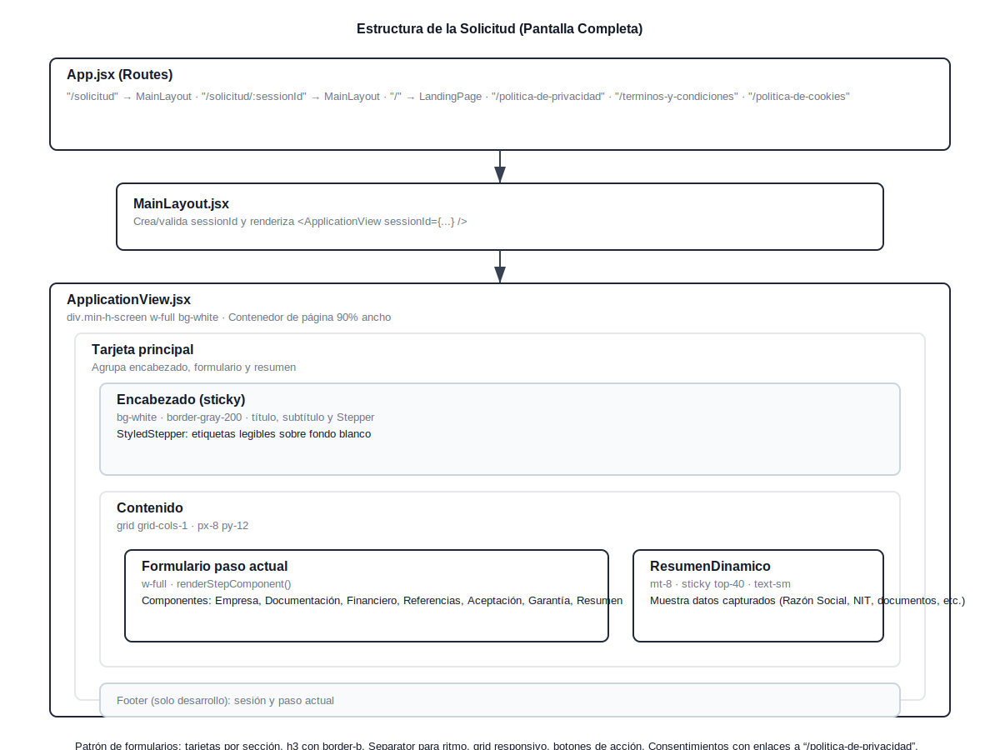

# Wy Credito - Plataforma de Financiamiento Empresarial

Una aplicación web moderna para gestión de créditos empresariales con IA integrada y landing page optimizada.

## 🚀 Características Principales

- 🤖 **Asistente de IA** con Google Gemini
- 📊 **Simulador de crédito** interactivo
- 📁 **Carga y análisis** de documentos
- 🔐 **Autenticación segura** con Supabase
- 📱 **Diseño responsive** y moderno
- ⚡ **Interfaz rápida** con React + Vite
- ✨ **Componentes UI avanzados** con Aceternity UI
- 🎨 **Animaciones fluidas** con Framer Motion

## 🛠️ Tecnologías

### Frontend
- **React 18** - Biblioteca principal
- **Vite** - Build tool y dev server
- **Tailwind CSS** - Framework de estilos
- **Aceternity UI** - Componentes UI avanzados
- **Framer Motion** - Animaciones

### Backend & Servicios
- **Supabase** - PostgreSQL, Auth, Storage
- **Google Gemini API** - Inteligencia Artificial
- **React Email + Resend** - Sistema de emails

### UI/UX
- **Material-UI** - Componentes base
- **Iconoir React** - Iconografía
- **Lucide React** - Iconos adicionales

## ⚡ Configuración Inicial

### 📖 Guía Completa de Configuración
Para una guía detallada de configuración de todas las APIs, consulta:
**[📋 CONFIGURACION_APIS.md](./CONFIGURACION_APIS.md)**

### 1. Clonar e Instalar

```bash
# Clonar el repositorio
git clone [URL_DEL_REPOSITORIO]
cd Wally

# Instalar dependencias
npm install
```

### Validar Configuración
```bash
npm run validate-config
```

### 2. Configurar Supabase

#### Opción A: Configuración Automática (Recomendada)

Ejecuta el script de configuración interactiva:

```bash
npm run setup-supabase
```

Este script te guiará paso a paso para:
- Verificar que tengas un proyecto de Supabase
- Configurar las variables de entorno
- Ejecutar el script de base de datos

#### Opción B: Configuración Manual

1. **Crear proyecto en Supabase**:
   - Ve a [https://supabase.com](https://supabase.com)
   - Crea un nuevo proyecto llamado "Wally-WyCredito"
   - Selecciona la región South America (São Paulo)

2. **Configurar variables de entorno**:
   
   Crea un archivo `.env` en la raíz del proyecto:

   ```env
   # Configuración de Supabase
   VITE_SUPABASE_URL=https://tu-proyecto.supabase.co
   VITE_SUPABASE_ANON_KEY=tu_anon_key_aqui
   VITE_SUPABASE_SERVICE_ROLE_KEY=tu-service-role-key-aqui  # Opcional pero recomendado
   
   # Configuración de la aplicación
   VITE_APP_NAME=Wally - Wy Crédito
   VITE_APP_VERSION=1.0.0
   
   # Configuración de desarrollo
   VITE_DEV_MODE=false
   ```

3. **Configurar base de datos**:
   - Ve a SQL Editor en tu proyecto de Supabase
   - Ejecuta el script `database/setup_database.sql`

### 3. Verificar Configuración

Después de configurar Supabase, reinicia el servidor:

```bash
npm run dev
```

La aplicación debería conectarse automáticamente a Supabase. Verifica en la consola del navegador que no hay errores de conexión.Google Gemini
VITE_GEMINI_API_KEY=TU_API_KEY_DE_GEMINI

# Configuración de la aplicación
VITE_APP_NAME=Wally
VITE_COMPANY_NAME=Wy Crédito Tecnología
```

### 3. Configurar la Base de Datos

Ejecuta el script `database/setup_database.sql` en el editor de SQL de tu proyecto de Supabase para crear las tablas y políticas de seguridad.

### 4. Ejecutar la Aplicación

```bash
# Modo desarrollo
npm run dev

# Construir para producción
npm run build

# Vista previa de producción
npm run preview
```

## 📁 Estructura del Proyecto

```
Wally/
├── src/                    # Código fuente principal
│   ├── App.jsx            # Componente principal
│   ├── main.jsx           # Punto de entrada
│   └── index.css          # Estilos globales
├── components/            # Componentes React
│   └── ChatInterface.jsx  # Interfaz de chat principal
├── database/              # Scripts de base de datos
│   └── setup_database.sql # Script de configuración
├── prompts/               # Prompts para Gemini
│   └── master_prompt.md   # Prompt maestro de Wally
├── docs/                  # Documentación adicional
├── package.json           # Dependencias y scripts
├── vite.config.js         # Configuración de Vite
├── tailwind.config.js     # Configuración de Tailwind
└── README.md              # Este archivo
```

## 🎨 Identidad Visual

El proyecto sigue el Brand Book de Wy Crédito con:

- **Colores Principales**: 
  - Azul Primario: `#1E40AF`
  - Azul Secundario: `#3B82F6`
  - Azul Accent: `#60A5FA`
- **Tipografía**: Inter (Google Fonts)
- **Estilo**: Minimalista, moderno y profesional

## 🤖 Características de Wally

- **Conversación Natural**: Utiliza Gemini AI para mantener conversaciones fluidas
- **Validación en Tiempo Real**: Verifica datos mientras el usuario los proporciona
- **Almacenamiento Progresivo**: Guarda información de forma incremental
- **Interfaz Responsiva**: Optimizada para desktop y móvil
- **Seguimiento de Estado**: Sistema de tracking de solicitudes

## 🔧 Scripts Disponibles

- `npm run dev` - Inicia el servidor de desarrollo
- `npm run build` - Construye la aplicación para producción
- `npm run preview` - Vista previa de la build de producción

## 📝 Próximos Pasos

1. Configurar las variables de entorno
2. Ejecutar el script de base de datos
3. Personalizar el prompt maestro según necesidades específicas
4. Probar la aplicación en modo desarrollo
5. Desplegar en producción

## 🆘 Soporte

Para soporte técnico o consultas sobre el proyecto, contacta al equipo de desarrollo de Wy Crédito Tecnología.

## 🗺️ Diagrama de Estructura de la Aplicación

- Referencia: `docs/diagrams/application-structure.svg`
- Vista rápida: 
- Abre el archivo directamente para verlo a resolución completa.

---

**Desarrollado con ❤️ por Wy Crédito Tecnología**