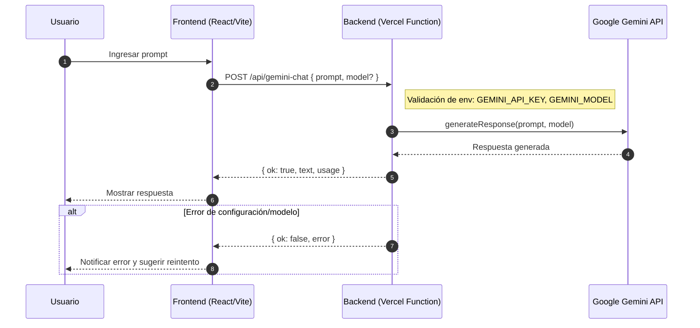

# Secuencia: /api/gemini-chat

Descripción del flujo de conversación segura con Gemini, manteniendo el API key en backend.

Entradas:
- `prompt` (string, requerido)
- `model` (opcional, por defecto `gemini-1.5-flash-latest`)

Salidas:
- `{ ok: true, text, usage }` o `{ ok: false, error }`

Notas:
- La API key (`GEMINI_API_KEY`) nunca se expone al frontend.
- Validar habilitación de Generative Language API y restricciones del key.