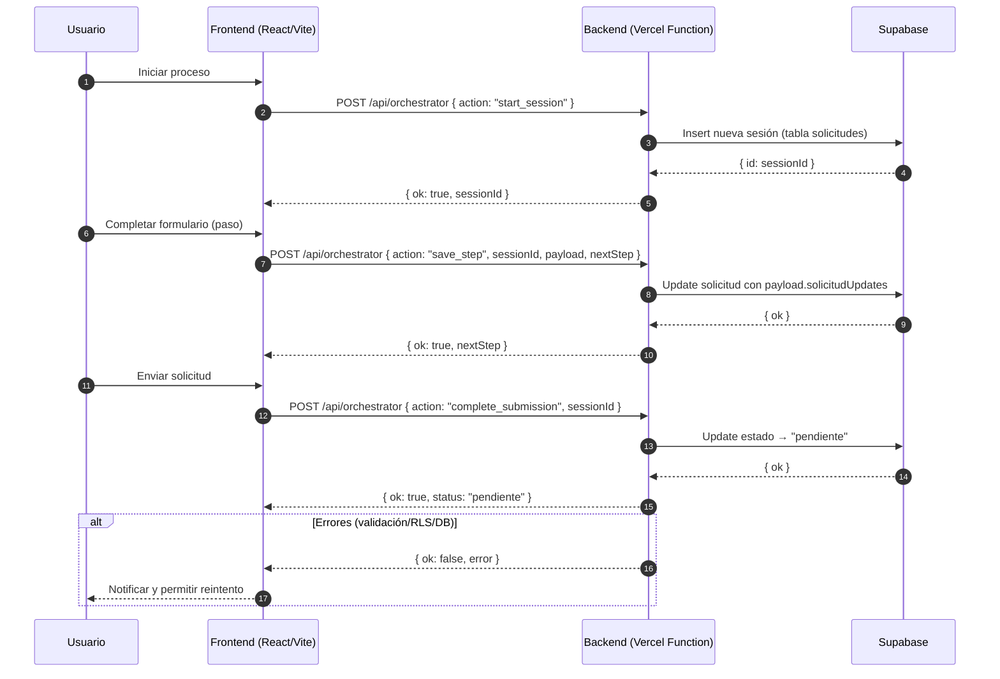

# Secuencia: /api/orchestrator

Descripción del flujo principal de orquestación de la solicitud de crédito (crear sesión, guardar pasos, completar envío).

Acciones soportadas:
- `start_session`: crea una nueva fila en `solicitudes` y retorna `sessionId`.
- `save_step`: actualiza campos de la solicitud; puede definir `nextStep`.
- `complete_submission`: marca la solicitud como `pendiente`.

Notas:
- Verificar RLS y políticas de Supabase; las funciones requieren permisos adecuados.
- Log de errores/latencias recomendado para diagnóstico y soporte.